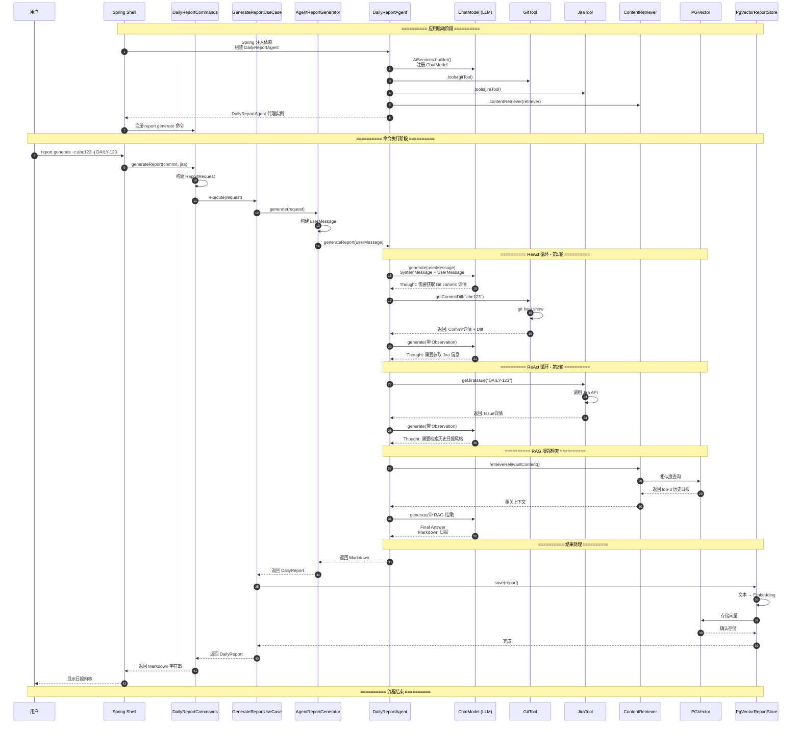

# Easy Daily Report - 运行原理详解

> 本文档深入剖析智能日报生成器的运行机制，涵盖 ReAct Agent、Tools 工具调用、RAG 增强检索的完整数据流。

---

## 📋 目录

1. [系统架构概览](#1-系统架构概览)
2. [代码运行流程](#2-代码运行流程)
3. [Demo 场景演示](#3-demo-场景演示)
4. [LangChain4j Tools 调用机制](#4-langchain4j-tools-调用机制)
5. [RAG 与向量数据库协作](#5-rag-与向量数据库协作)
6. [完整 Timeline 时序图](#6-完整-timeline-时序图)

---

## 1. 系统架构概览

### 1.1 分层架构图

```
┌─────────────────────────────────────────────────────────────────┐
│                        用户交互层 (Shell)                        │
│  ┌─────────────────────────────────────────────────────────┐  │
│  │  DailyReportCommands                                    │  │
│  │  - report generate -c <commit> -j <jira>               │  │
│  │  - report help                                         │  │
│  └─────────────────────────────────────────────────────────┘  │
└─────────────────────────────┬───────────────────────────────────┘
                              │
┌─────────────────────────────▼───────────────────────────────────┐
│                       应用服务层 (Application)                   │
│  ┌─────────────────────────────────────────────────────────┐  │
│  │  GenerateReportUseCase                                  │  │
│  │  职责：编排日报生成流程，协调 Domain 端口               │  │
│  │                                                         │  │
│  │  execute(request):                                      │  │
│  │    1. report = generator.generate(request)             │  │
│  │    2. store.save(report)                               │  │
│  │    3. return report                                     │  │
│  └─────────────────────────────────────────────────────────┘  │
└─────────────────────────────┬───────────────────────────────────┘
                              │
┌─────────────────────────────▼───────────────────────────────────┐
│                       领域层 (Domain)                            │
│  ┌───────────────────┐  ┌───────────────────┐  ┌──────────────┐ │
│  │  ReportGenerator  │  │  ReportStore      │  │  Ports       │ │
│  │  (接口)           │  │  (接口)           │  │  - GitPort   │ │
│  └─────────┬─────────┘  └─────────┬─────────┘  │  - JiraPort  │ │
└────────────┼─────────────────────┼──────────┴───────┬────────┘
             │                     │                  │
┌────────────▼─────────────────────▼──────────────────▼────────┐
│                    基础设施层 (Infrastructure)               │
│                                                            │
│  ┌─────────────────┐  ┌─────────────────┐  ┌─────────────┐ │
│  │ AgentReport     │  │ PgVectorReport  │  │  Adapters     │ │
│  │ Generator       │  │ Store           │  │  - JGitAdapter│ │
│  │                 │  │                 │  │  - JiraAdapter│ │
│  └────────┬────────┘  └────────┬────────┘  └─────────────┘ │
│           │                    │                           │
│  ┌────────▼────────────────────▼──────────────────────────┐ │
│  │              LangChain4j AI 组件层                    │ │
│  │                                                        │ │
│  │  ┌──────────────┐  ┌──────────┐  ┌────────────────┐ │ │
│  │  │ DailyReport  │  │ Tools    │  │ RAG Components │ │ │
│  │  │ Agent        │  │ - GitTool│  │ - Embedding    │ │ │
│  │  │ (ReAct模式)  │  │ - JiraTool│ │ - ContentRetriever│ │ │
│  │  └──────────────┘  └──────────┘  └────────────────┘ │ │
│  │                                                        │ │
│  │  ┌──────────────┐  ┌──────────┐  ┌────────────────┐ │ │
│  │  │ ChatModel    │  │ ChatMemory│  │ PGVector       │ │ │
│  │  │ (LLM核心)    │  │ (上下文)  │  │ (向量数据库)   │ │ │
│  │  └──────────────┘  └──────────┘  └────────────────┘ │ │
│  └───────────────────────────────────────────────────────┘ │
└────────────────────────────────────────────────────────────┘
```

### 1.2 核心组件关系

```
User Input
    │
    ▼
DailyReportCommands ──────► GenerateReportUseCase
    │                           │
    │                           ▼
    │                   AgentReportGenerator
    │                           │
    │                           ▼
    │                   DailyReportAgent (LangChain4j)
    │                           │
    │          ┌────────────────┼────────────────┐
    │          │                │                │
    │          ▼                ▼                ▼
    │    ┌─────────┐    ┌──────────┐    ┌─────────────┐
    │    │ ChatModel│    │  Tools   │    │  RAG        │
    │    │ (LLM)   │    │ Git/Jira │    │ 历史检索    │
    │    └─────────┘    └──────────┘    └─────────────┘
    │                                          │
    │                                          ▼
    │                              ┌──────────────────────┐
    │                              │ PGVector             │
    │                              │ (Embedding Store)    │
    │                              └──────────────────────┘
    ▼
DailyReport (Markdown)
    │
    ▼
PgVectorReportStore.save() ────► 向量数据库 (持久化)
```

---

## 2. 代码运行流程

### 2.1 启动流程

```
┌────────────────────────────────────────────────────────────┐
│                      应用启动阶段                           │
└────────────────────────────────────────────────────────────┘

1. Spring Boot 启动
   └── 扫描 @Component, @Service, @Configuration

2. 配置类初始化 (按依赖顺序)
   ├── ChatModelConfig ────────► 创建 ChatModel (LLM客户端)
   ├── LangChain4jConfig ──────► ChatMemory, ContentRetriever
   ├── PgVectorConfig ─────────► EmbeddingModel, EmbeddingStore
   └── 其他 Infrastructure Bean

3. Agent 组装
   └── AiServices.builder(DailyReportAgent.class)
       ├── .chatModel(chatModel)
       ├── .chatMemory(chatMemory)
       ├── .contentRetriever(contentRetriever)  [RAG]
       ├── .tools(gitTool, jiraTool)            [Tools]
       └── .build() ────────► DailyReportAgent 代理实例

4. Shell 命令注册
   └── DailyReportCommands 注册到 Spring Shell
       ├── "report generate" 命令
       └── "report help" 命令

5. 进入交互模式
   └── shell:> 提示符等待用户输入
```

### 2.2 命令执行流程

```
用户输入: report generate -c abc123 -j PROJ-456

Step 1: 命令解析 (Spring Shell)
─────────────────────────────────
DailyReportCommands.generateReport(
    commitHash = "abc123",
    jiraIssueKey = "PROJ-456",
    ...
)

Step 2: 构建领域请求对象
─────────────────────────────────
ReportRequest request = new ReportRequest(
    commitHash: "abc123",
    commitRange: null,
    jiraIssueKey: "PROJ-456",
    repoPath: null  // 使用默认值
)

Step 3: 用例层编排
─────────────────────────────────
GenerateReportUseCase.execute(request)
    ├── reportGenerator.generate(request)
    └── reportStore.save(report)

Step 4: AI 生成 (核心流程)
─────────────────────────────────
AgentReportGenerator.generate(request)
    ├── 构建用户消息: "请生成工作日报。请分析 Git Commit: abc123 关联 Jira Issue: PROJ-456"
    └── agent.generateReport(userMessage)  [进入 ReAct 循环]

Step 5: 持久化存储
─────────────────────────────────
PgVectorReportStore.save(report)
    ├── 日报文本 → Embedding (AllMiniLmL6V2)
    └── 存储到 PGVector (向量 + 元数据)

Step 6: 返回结果
─────────────────────────────────
返回 Markdown 格式的日报文本
```

---

## 3. Demo 场景演示

### 3.1 完整交互示例

**场景**：开发者小王完成了一个功能提交，需要生成日报。

```bash
# Step 1: 启动应用
$ ./run.sh

╔════════════════════════════════════════════════════════════╗
║              Easy Daily Report - 智能日报生成器            ║
╚════════════════════════════════════════════════════════════╝

[INFO] 检测到 Java 版本: 21.0.6
[INFO] 加载环境变量: .env
[SUCCESS] 环境变量加载完成
[INFO] 启动 Easy Daily Report...
[INFO] 按 Ctrl+C 停止应用

  .   ____          _            __ _ _
 /\\ / ___'_ __ _ _(_)_ __  __ _ \ \ \ \
( ( )\___ | '_ | '_| | '_ \/ _` |\ \ \ \
 \\/  ___)| |_)| | | | | || (_| |  ) ) ) )
  '  |____| .__|_| |_|_| |_\__, | / / / /
 =========|_|==============|___/=/_/_/_/
 :: Spring Boot ::                (v4.0.6)

# 进入交互模式
shell:> report generate -c a1b2c3d -j DAILY-123

[INFO] 开始生成日报，commit: a1b2c3d, jira: DAILY-123
[INFO] Agent 开始生成日报...

# LangChain4j ReAct 循环开始
[LLM] Thought: 用户需要生成日报，提供了 commit hash 和 jira issue。
        我需要先获取代码变更详情和 Jira 信息。
[LLM] Action: 调用 getCommitDiff("a1b2c3d")
[Tool] GitTool.getCommitDiff 执行...
        返回: Commit: a1b2c3d | Author: wang | Message: 添加用户登录功能

[LLM] Thought: 已获取代码变更，现在需要 Jira 详情。
[LLM] Action: 调用 getJiraIssue("DAILY-123")
[Tool] JiraTool.getJiraIssue 执行...
        返回: Issue: DAILY-123 | Summary: 实现用户认证模块 | Status: In Progress

[LLM] Thought: 已获取所有必要信息，同时检索历史日报保持风格一致。
[LLM] Action: 检索相似历史日报 (RAG)
[RAG] 查询向量数据库，返回 3 条相关历史日报...

[LLM] Thought: 现在可以生成完整的日报了。
[LLM] Final Answer: (生成 Markdown 日报)

[INFO] Agent 日报生成完成
[INFO] 日报已保存到向量数据库，日期: 2026-04-30
[INFO] 日报已生成并保存
```

**最终输出**：

```markdown
## 📅 工作日报 - 2026-04-30

### 📋 任务概述
今日主要完成用户认证模块的开发工作，实现了登录功能的核心逻辑。

### 💻 代码变更要点
- **新增登录接口** (`a1b2c3d`)
  - 实现了基于 JWT 的认证机制
  - 添加了密码加密存储功能
  - 编写了完整的单元测试覆盖

### 💼 业务价值
- 关联 Jira: **DAILY-123 - 实现用户认证模块**
- 状态: In Progress
- 该功能为后续用户权限管理奠定基础

### ⚠️ 潜在风险与优化建议
- 建议添加登录失败次数限制，防止暴力破解
- 考虑实现双因素认证增强安全性

### 📌 明日计划
- 完成登录页面 UI 开发
- 集成测试验证
```

---

## 4. LangChain4j Tools 调用机制

### 4.1 ReAct 模式工作原理

```
┌─────────────────────────────────────────────────────────────────┐
│                    ReAct (Reasoning + Acting)                   │
│                                                                 │
│  循环: Thought → Action → Observation → Thought → ... → Answer │
└─────────────────────────────────────────────────────────────────┘

用户输入: "生成日报，commit: abc123, jira: DAILY-123"

         ┌──────────────────────────────────────┐
         │  LLM (ChatModel)                     │
         │                                      │
         │  SystemMessage: "你是日报助手..."   │
         │  UserMessage: "生成日报..."          │
         │  Available Tools: [GitTool, JiraTool]│
         └──────────────┬───────────────────────┘
                        │
                        ▼
         ┌──────────────────────────────────────┐
         │  Thought (思考)                      │
         │  "我需要获取 Git commit 详情和      │
         │   Jira issue 信息才能生成日报"       │
         └──────────────┬───────────────────────┘
                        │
                        ▼
         ┌──────────────────────────────────────┐
         │  Action (行动)                       │
         │  调用 Tool: getCommitDiff("abc123")  │
         └──────────────┬───────────────────────┘
                        │
                        ▼
         ┌──────────────────────────────────────┐
         │  Tool Execution                      │
         │  GitTool.getCommitDiff 执行         │
         │  返回: Commit 详情                   │
         └──────────────┬───────────────────────┘
                        │
                        ▼
         ┌──────────────────────────────────────┐
         │  Observation (观察)                  │
         │  "获取到代码变更: 添加用户登录功能"   │
         └──────────────┬───────────────────────┘
                        │
                        ▼ (循环继续...)
         ┌──────────────────────────────────────┐
         │  Thought                             │
         │  "现在需要获取 Jira 信息"            │
         └──────────────┬───────────────────────┘
                        │
                        ▼
         ┌──────────────────────────────────────┐
         │  Action                              │
         │  调用 Tool: getJiraIssue("DAILY-123")│
         └──────────────┬───────────────────────┘
                        │
                        ▼
         ┌──────────────────────────────────────┐
         │  Observation                         │
         │  "获取到 Jira: 实现用户认证模块"      │
         └──────────────┬───────────────────────┘
                        │
                        ▼ (信息足够，生成答案)
         ┌──────────────────────────────────────┐
         │  Final Answer                        │
         │  生成完整日报 Markdown               │
         └──────────────────────────────────────┘
```

### 4.2 Tools 注册与调用

```java
// LangChain4jConfig.java - Tools 注册
@Bean
public DailyReportAgent dailyReportAgent(
        ChatModel chatModel,
        GitTool gitTool,      // ← 注入 Git 工具
        JiraTool jiraTool     // ← 注入 Jira 工具
) {
    return AiServices.builder(DailyReportAgent.class)
            .chatModel(chatModel)
            .tools(gitTool, jiraTool)  // ← 注册到 Agent
            .build();
}

// GitTool.java - Tool 定义
@Component
public class GitTool {
    @Tool("获取指定 commit 的代码 diff 详情")  // ← Tool 描述
    public String getCommitDiff(String commitHash) {
        // 实现...
    }
}
```

### 4.3 Tools 调用时序

```
┌─────────┐     ┌──────────────┐     ┌─────────────┐     ┌─────────────┐
│  User   │     │ DailyReport  │     │  LangChain4j │     │   GitTool   │
│         │     │    Agent     │     │   Framework  │     │             │
└────┬────┘     └──────┬───────┘     └──────┬──────┘     └──────┬──────┘
     │                 │                    │                    │
     │ generateReport()│                    │                    │
     │────────────────>│                    │                    │
     │                 │                    │                    │
     │                 │  LLM.generate()    │                    │
     │                 │───────────────────>│                    │
     │                 │                    │                    │
     │                 │                    │  解析 Tool 调用      │
     │                 │                    │  需要 getCommitDiff  │
     │                 │                    │                    │
     │                 │                    │  execute Tool      │
     │                 │                    │───────────────────>│
     │                 │                    │                    │
     │                 │                    │                    │ gitPort.getCommitDetail()
     │                 │                    │                    │───────────────>
     │                 │                    │                    │
     │                 │                    │  return diff       │
     │                 │                    │<───────────────────│
     │                 │                    │                    │
     │                 │  return result     │                    │
     │                 │<───────────────────│                    │
     │                 │                    │                    │
     │                 │  (继续 ReAct 循环)  │                    │
     │                 │       ...          │                    │
     │                 │                    │                    │
     │                 │  最终生成日报       │                    │
     │  return report  │                    │                    │
     │<────────────────│                    │                    │
```

---

## 5. RAG 与向量数据库协作

### 5.1 RAG (Retrieval-Augmented Generation) 架构

```
┌────────────────────────────────────────────────────────────────────────┐
│                          RAG 增强检索流程                               │
└────────────────────────────────────────────────────────────────────────┘

                    日报生成流程
                          │
          ┌───────────────┼───────────────┐
          │               │               │
          ▼               ▼               ▼
    ┌──────────┐   ┌──────────┐   ┌──────────────┐
    │ 用户输入  │   │ LLM 生成 │   │ 历史日报检索 │
    │          │   │          │   │   (RAG)      │
    └──────────┘   └────┬─────┘   └──────┬───────┘
                        │                │
                        │    ┌───────────▼──────────┐
                        │    │ ContentRetriever     │
                        │    │ 根据当前 query 检索    │
                        │    │ 相似的历史日报         │
                        │    └───────────┬──────────┘
                        │                │
                        ▼                ▼
                ┌─────────────────────────────────┐
                │          LLM 上下文             │
                │  ┌───────────────────────────┐  │
                │  │ System Message            │  │
                │  │ User Message (当前请求)    │  │
                │  │ RAG Results (历史日报 x3)  │  │
                │  │                           │  │
                │  │ "参考历史日报风格: ..."    │  │
                │  └───────────────────────────┘  │
                └─────────────────────────────────┘
                          │
                          ▼
                  生成风格一致的日报
```

### 5.2 向量数据库交互流程

#### 存储流程 (Save)

```
DailyReport (Markdown 文本)
        │
        ▼
┌───────────────────────────────┐
│ PgVectorReportStore.save()    │
│                               │
│ 1. TextSegment.from(          │
│      text: 日报内容,           │
│      metadata: {               │
│        date: "2026-04-30",     │
│        type: "daily-report"    │
│      }                         │
│    )                           │
└───────────────┬───────────────┘
                │
                ▼
┌───────────────────────────────┐
│ EmbeddingModel.embed(segment) │
│                               │
│ AllMiniLmL6V2 模型            │
│ 文本 → 384维向量              │
└───────────────┬───────────────┘
                │
                ▼
┌───────────────────────────────┐
│ EmbeddingStore.add(           │
│   embedding,                  │
│   segment                     │
│ )                             │
│                               │
│ PGVector 数据库               │
│ 表: report_embeddings          │
│ - embedding: vector(384)      │
│ - text: 日报内容              │
│ - metadata: JSON             │
└───────────────────────────────┘
```

#### 检索流程 (Retrieve)

```
用户输入: "生成日报..."
        │
        ▼
┌───────────────────────────────┐
│ ContentRetriever 检索         │
│                               │
│ 1. 构建查询向量               │
│    embeddingModel.embed(      │
│      "生成日报 代码变更..."   │
│    )                          │
└───────────────┬───────────────┘
                │
                ▼
┌───────────────────────────────┐
│ EmbeddingStore.search(        │
│   EmbeddingSearchRequest      │
│     .maxResults(3)            │
│     .minScore(0.7)            │
│ )                             │
│                               │
│ PGVector 相似度查询           │
│ (向量余弦相似度)              │
└───────────────┬───────────────┘
                │
                ▼
┌───────────────────────────────┐
│ 返回 Top-3 相似日报           │
│                               │
│ 1. "2026-04-29 日报..." (0.92)│
│ 2. "2026-04-28 日报..." (0.85)│
│ 3. "2026-04-25 日报..." (0.78)│
└───────────────────────────────┘
        │
        ▼
注入 LLM 上下文，保持风格一致
```

### 5.3 向量存储与检索组件

```java
// PgVectorConfig.java - 向量存储配置
@Configuration
public class PgVectorConfig {
    
    @Bean
    public EmbeddingModel embeddingModel() {
        // AllMiniLmL6V2: 将文本转换为 384维向量
        return new AllMiniLmL6V2EmbeddingModel();
    }
    
    @Bean
    @Lazy
    public EmbeddingStore<TextSegment> embeddingStore(
            @Value("${pgvector.host}") String host,
            ...
    ) {
        return PgVectorEmbeddingStore.builder()
                .host(host)
                .port(port)
                .database(database)
                .table("report_embeddings")  // 存储表名
                .dimension(384)              // 向量维度
                .createTable(true)           // 自动建表
                .build();
    }
}

// LangChain4jConfig.java - RAG 组件配置
@Bean
@Lazy
public ContentRetriever contentRetriever(
        EmbeddingStore<TextSegment> embeddingStore,
        EmbeddingModel embeddingModel,
        @Value("${langchain4j.rag.max-results:3}") int maxResults
) {
    return EmbeddingStoreContentRetriever.builder()
            .embeddingStore(embeddingStore)
            .embeddingModel(embeddingModel)
            .maxResults(maxResults)  // 检索 top-3
            .build();
}
```

---

## 6. 完整 Timeline 时序图

### 6.1 端到端交互时序



### 6.2 时间线详细分解

| 阶段 | 时间 | 动作 | 说明 |
|------|------|------|------|
| **T0** | 0ms | 用户输入命令 | `report generate -c abc123 -j DAILY-123` |
| **T1** | ~10ms | Spring Shell 解析 | 提取参数，调用 `DailyReportCommands.generateReport()` |
| **T2** | ~20ms | 构建请求对象 | 创建 `ReportRequest` 领域对象 |
| **T3** | ~30ms | 进入用例层 | `GenerateReportUseCase.execute()` 编排开始 |
| **T4** | ~50ms | AI 生成开始 | `AgentReportGenerator.generate()` 调用 Agent |
| **T5** | ~100ms | **ReAct 第1轮** | LLM 思考 → 决定调用 `getCommitDiff` |
| **T6** | ~500ms | Git 工具执行 | `GitTool` 执行 `git show abc123`，获取代码变更 |
| **T7** | ~600ms | Observation | 返回 Commit 详情给 LLM |
| **T8** | ~800ms | **ReAct 第2轮** | LLM 思考 → 决定调用 `getJiraIssue` |
| **T9** | ~1500ms | Jira 工具执行 | `JiraTool` 调用 API 获取 Issue 信息 |
| **T10** | ~1600ms | Observation | 返回 Jira 详情给 LLM |
| **T11** | ~1800ms | **RAG 检索** | `ContentRetriever` 查询向量数据库 |
| **T12** | ~1900ms | 向量检索 | PGVector 执行相似度搜索 |
| **T13** | ~2100ms | 历史日报返回 | 返回 top-3 相似历史日报 |
| **T14** | ~2500ms | **LLM 最终生成** | 综合所有信息，生成 Markdown 日报 |
| **T15** | ~3000ms | 日报返回 | `DailyReportAgent` 返回最终答案 |
| **T16** | ~3100ms | 持久化存储 | `PgVectorReportStore.save()` 开始 |
| **T17** | ~3150ms | Embedding | AllMiniLmL6V2 将日报文本转为向量 |
| **T18** | ~3200ms | 向量存储 | 写入 PGVector 数据库 |
| **T19** | ~3250ms | 存储确认 | PGVector 返回存储成功 |
| **T20** | ~3300ms | 结果返回 | 日报内容返回给 Shell |
| **T21** | ~3350ms | 显示输出 | 用户看到生成的 Markdown 日报 |

**总耗时**: ~3.4 秒 (不含网络延迟)

### 6.3 关键路径说明

```
关键路径 (影响响应时间的环节):
━━━━━━━━━━━━━━━━━━━━━━━━━━━━━━━━━━━━━━━━━━━━━━
1. LLM API 调用 (ReAct 多轮对话)
   └─ 2-3 轮对话 × 500ms = ~1000-1500ms
   
2. Jira API 调用
   └─ 网络延迟 ~500-1000ms
   
3. Git 操作
   └─ 本地执行 ~100-500ms (取决于仓库大小)
   
4. 向量检索
   └─ PGVector 查询 ~100-200ms
   
5. 最终日报生成
   └─ LLM 生成长文本 ~500-1000ms
━━━━━━━━━━━━━━━━━━━━━━━━━━━━━━━━━━━━━━━━━━━━━━

优化方向:
- 使用更快的 LLM (如 glm-4-flash)
- 本地缓存 Jira 数据
- 异步执行日报存储
```

---

## 附录：关键代码片段

### A. Agent 接口定义

```java
public interface DailyReportAgent {
    @SystemMessage("""
        你是一个专业的工作日报生成助手。
        使用 ReAct 模式自主调用工具收集信息，
        生成结构化的工作日报。
        """)
    String generateReport(@UserMessage String userRequest);
}
```

### B. Agent 组装配置

```java
@Bean
public DailyReportAgent dailyReportAgent(
        ChatModel chatModel,
        ChatMemory chatMemory,
        ContentRetriever contentRetriever,  // RAG
        GitTool gitTool,                    // Tools
        JiraTool jiraTool                   // Tools
) {
    return AiServices.builder(DailyReportAgent.class)
            .chatModel(chatModel)
            .chatMemory(chatMemory)
            .contentRetriever(contentRetriever)  // 启用 RAG
            .tools(gitTool, jiraTool)          // 注册 Tools
            .build();
}
```

### C. 向量存储配置

```java
@Bean
public EmbeddingStore<TextSegment> embeddingStore(...) {
    return PgVectorEmbeddingStore.builder()
            .host("localhost")
            .port(5432)
            .table("report_embeddings")
            .dimension(384)       // AllMiniLmL6V2 维度
            .createTable(true)
            .build();
}
```

---

**文档版本**: 1.0  
**最后更新**: 2026-04-30  
**作者**: Paige (Technical Writer)
